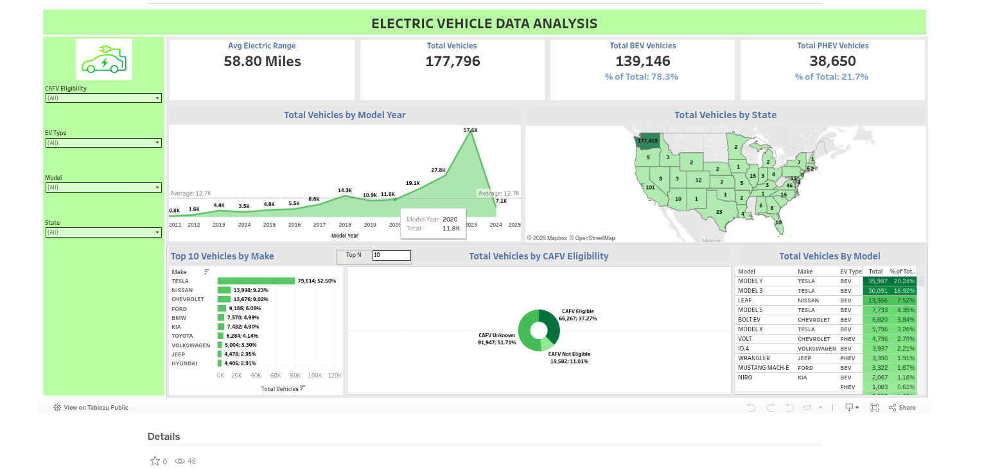

# EV Data Analysis Dashboard

## Overview

This project involves the creation of an interactive dashboard to analyze electric vehicle (EV) data in the United States. The dashboard is built using Tableau and offers insights into various aspects of EV adoption, usage, and trends over time.

## Features

- Data Visualization Total EVs over Time: A line chart showing the growth of electric vehicles over the years. EV Market Share by State: A heatmap illustrating the distribution and density of EVs across different states. Popular EV Models: A bar chart depicting the most popular electric vehicle models based on sales data. Charging Stations: Information on the number and location of charging stations.
- Interactivity Filter by Year: Allows users to filter the data based on specific years. State-wise Analysis: Users can click on a state to see detailed EV data for that state. Model-wise Analysis: Provides the ability to focus on specific EV models.
- User-Friendly Interface Dashboard Layout: Clean and intuitive layout designed for easy navigation and data interpretation. Tooltips: Hovering over data points provides additional information for deeper insights.
## Technologies Used

Tableau: Used for creating the interactive dashboard and visualizations. Data Source: The dataset used includes various parameters related to electric vehicles, such as sales figures, model types, and geographical distribution.
## Dashboard

